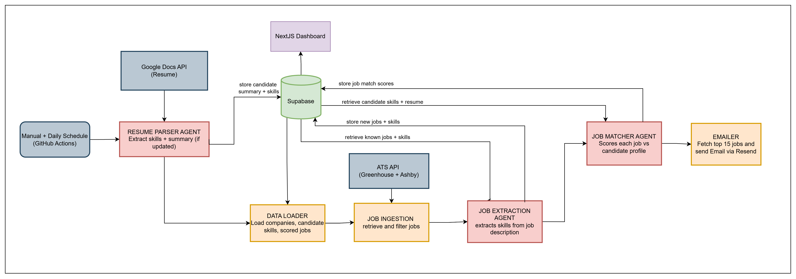
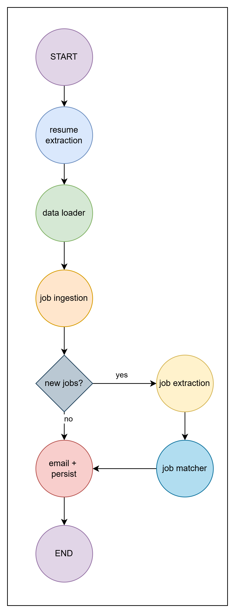

# Job Search Buddy

An automated job search system that fetches engineering roles daily, scores them against your resume using LLMs, and delivers a ranked digest to your inbox — with a dashboard to track applications and analyze skill trends.

---

## What it does

1. **Fetches** new job postings every morning from Greenhouse and Ashby ATS boards across a curated list of companies
2. **Filters** out non-US roles, irrelevant titles (sales, HR, design, director-level), stale postings, and jobs that deny visa sponsorship
3. **Scores** each job against your resume on skill fit, role fit, and experience fit using a multi-provider LLM chain
4. **Ranks** results by a composite score that also factors in posting recency and company tier (FAANG / unicorn / startup)
5. **Emails** a daily HTML digest of top matches with embedded resume-tailoring prompts
6. **Tracks** applications through a dashboard — from new match to interviewing

---

## Architecture


---

## Pipeline Flow


| Node | What it does |
|---|---|
| `resume_extraction` | Pulls resume from Google Drive, extracts skills via LLM (skips if unchanged) |
| `data_loader` | Loads companies, candidate skills, and already-scored job IDs from DB |
| `job_ingestion` | Fetches from each company's ATS, filters, splits new vs. known |
| `job_extraction` | LLM skill extraction for new jobs; DB cache lookup for known jobs |
| `job_matcher` | Scores each job against candidate profile; skips already-scored (idempotent) |
| `emailer` | Sends digest, saves LLM usage stats and errors to DB |

---

## Dashboard Pages

| Route | Description |
|---|---|
| `/jobs` | Ranked job matches — "To Apply" and "Applied" tabs. Update status inline. |
| `/skills` | Top skills in demand this week, 8-week trend chart, gap analysis vs. your resume |
| `/monitor` | LLM usage per pipeline run — calls, tokens, provider, avg latency; pipeline error logs |

---

## Tech Stack

| Layer | Technology |
|---|---|
| Pipeline orchestration | [LangGraph](https://github.com/langchain-ai/langgraph) StateGraph |
| LLM — skill extraction | Cerebras (primary) → SambaNova → Groq → Gemini |
| LLM — job matching | Cerebras (primary) → Groq → OpenRouter → Gemini |
| LLM — resume parsing | Cerebras (primary) → Groq → Gemini |
| Database | Supabase (PostgreSQL) |
| ATS sources | Greenhouse Boards API, Ashby Posting API |
| Resume source | Google Docs (via OAuth 2.0) |
| Email delivery | [Resend](https://resend.com) |
| Dashboard | Next.js 16, React 19, TypeScript, Tailwind CSS, Recharts |
| Hosting | GitHub Actions (pipeline) · dashboard runs locally |

---

## Setup

### Backend

```bash
cd backend
python -m venv venv
source venv/Scripts/activate   # Windows bash
pip install -r requirements.txt
```

Copy `.env.example` to `.env` and fill in:

```
# LLM providers
CEREBRAS_API_KEY=
SAMBANOVA_API_KEY=
GROQ_API_KEY=
GEMINI_API_KEY=
OPENROUTER_API_KEY=

# Database
SUPABASE_URL=
SUPABASE_KEY=

# Email
RESEND_API_KEY=
RESEND_FROM_EMAIL=
RESEND_TO_EMAIL=

# Resume source
RESUME_DOC_ID=
GOOGLE_CLIENT_ID=
GOOGLE_CLIENT_SECRET=
GOOGLE_REFRESH_TOKEN=

# Pipeline controls
MAX_NEW_JOBS=30    # cap LLM calls on first run; set to 0 after
```

Run migrations in order via the Supabase SQL editor:

```
migrations/001_init.sql
migrations/002_add_status.sql
migrations/003_seed_companies.sql
migrations/004_llm_usage.sql
migrations/005_pipeline_errors.sql
migrations/006_add_companies.sql
migrations/007_llm_usage_by_provider.sql
```

Run the pipeline:

```bash
python main.py
```

### Frontend

```bash
cd frontend
npm install
```

Create `.env.local`:

```
SUPABASE_URL=your_supabase_url
SUPABASE_KEY=your_supabase_service_key
```

```bash
npm run dev   # http://localhost:3000
```

### GitHub Actions (daily schedule)

Add these repository secrets in **Settings → Secrets → Actions**:

```
CEREBRAS_API_KEY, SAMBANOVA_API_KEY, GROQ_API_KEY, GEMINI_API_KEY, OPENROUTER_API_KEY
SUPABASE_URL, SUPABASE_SERVICE_ROLE_KEY
RESEND_API_KEY, RESEND_FROM_EMAIL, RESEND_TO_EMAIL
RESUME_DOC_ID, GOOGLE_CLIENT_ID, GOOGLE_CLIENT_SECRET, GOOGLE_REFRESH_TOKEN
```

The pipeline runs automatically at **7am MST** daily. Trigger manually from the Actions tab.

---

## LLM Models

Each pipeline task has a dedicated primary model chosen for speed, cost, and output reliability. All tasks have a fallback chain — if the primary fails or times out, the next provider is tried automatically.

### Resume Skill Extraction

Parses raw resume text and outputs a structured JSON list of skills. Requires strict JSON adherence and zero creativity — temperature 0.0.

| Priority | Provider | Model |
|---|---|---|
| Primary | Cerebras | `qwen-3-235b-a22b-instruct-2507` |
| Fallback 1 | Groq | `llama-3.3-70b-versatile` |
| Fallback 2 | SambaNova | `Meta-Llama-4-Maverick-17B-128E-Instruct` |
| Fallback 3 | Gemini | `gemini-3.1-flash-lite-preview` |

**Why Cerebras Qwen-3-235b primary:** Cerebras' wafer-scale inference gives near-instant responses on a large MoE model, keeping resume parsing fast even with a long resume as input.

---

### Resume Condensation

Condenses the extracted skill list + resume context into a plain-text candidate profile stored in the DB and reused in every job match prompt. Low creativity needed — temperature 0.2, text output.

| Priority | Provider | Model |
|---|---|---|
| Primary | Cerebras | `llama3.1-8b` |
| Fallback 1 | Groq | `qwen/qwen3-32b` |
| Fallback 2 | Gemini | `gemini-3.1-flash-lite-preview` |

**Why Cerebras Llama-3.1-8b primary:** A small model is sufficient for summarization — the task is deterministic rewriting, not reasoning. Cerebras hardware makes it extremely fast and cheap.

---

### Job Skill Extraction

Extracts `role_type`, `seniority`, `years_required`, and `skills[]` from raw job description text. Runs for every new job posting (known jobs use cached DB results). High token output — up to 4096 tokens per call. Temperature 0.0.

| Priority | Provider | Model |
|---|---|---|
| Primary | Cerebras | `qwen-3-235b-a22b-instruct-2507` |
| Fallback 1 | SambaNova | `Qwen3-32B` |
| Fallback 2 | Groq | `llama-3.3-70b-versatile` |
| Fallback 3 | Gemini | `gemini-3.1-flash-lite-preview` |

**Why Cerebras Qwen-3-235B primary:** Fast inference for bulk extraction — runs for every new job posting in the pipeline. SambaNova's Qwen3-32B is first fallback given its strong structured extraction capability and higher token throughput tolerance.

---

### Job–Resume Matching

The most important task: scores each job against the candidate profile on `skill_fit`, `role_fit`, and `experience_fit` (0–100 each), and identifies matched skills, gap skills, green flags, and red flags. Requires reasoning quality. Temperature 0.1.

| Priority | Provider | Model |
|---|---|---|
| Primary | Cerebras | `qwen-3-235b-a22b-instruct-2507` |
| Fallback 1 | Groq | `llama-3.3-70b-versatile` |
| Fallback 2 | OpenRouter | `deepseek/deepseek-r1-distill-llama-70b:free` |
| Fallback 3 | Gemini | `gemini-3.1-flash-lite-preview` |

**Why Cerebras Qwen-3-235b primary:** The largest model in the stack for the highest-stakes task. Qwen-3-235b is a strong reasoning model; Cerebras hardware keeps latency acceptable even at that scale. DeepSeek R1 (via OpenRouter) is in the fallback chain because its reasoning traces produce reliable structured JSON even when other models hallucinate fields.

---

## Database Schema

| Table | Purpose |
|---|---|
| `companies` | Tracked companies with ATS metadata and tier |
| `jobs` | All fetched job postings |
| `job_skills` | Extracted skills per job (cached to avoid re-extraction) |
| `candidate_skills` | Skills extracted from your resume |
| `candidate_profile` | Condensed resume text used in job matching |
| `resume_matches` | Daily scored matches — one row per `(job_id, run_date)` |
| `llm_usage` | Per-run LLM metrics: calls, tokens, provider, latency |
| `pipeline_errors` | Error logs per node per run |
